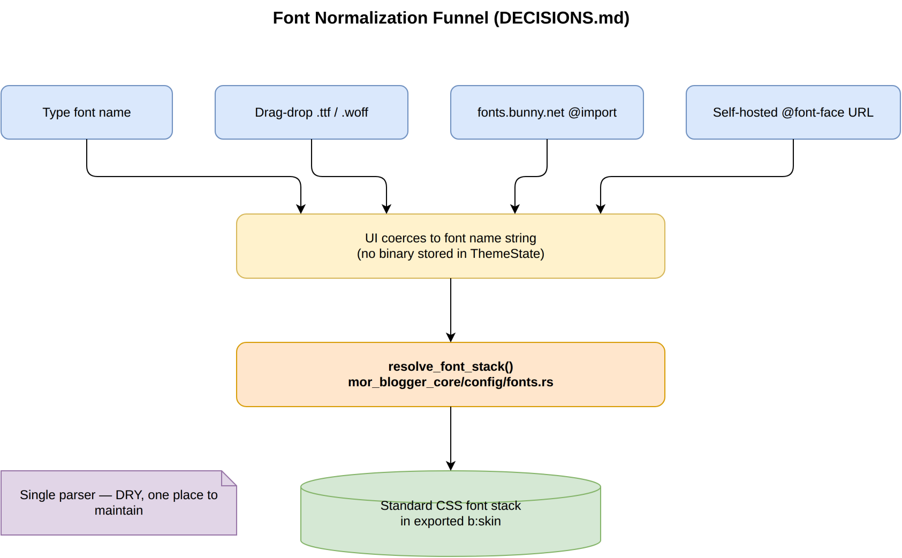

# Architectural Decision Records (ADR)

## Built-in plugins: table match, not trait objects (2026-07-24)

**CONTEXT:** Four hard-coded render plugins lived behind `Box<dyn MorBloggerPlugin>` with empty default trait methods. Call sites only needed JS strings and XML widgets.

**DECISION:** `ActivePlugin { js, widgets }` + `plugin_by_id` match. Same contributions, no trait.

**CONSEQUENCES:** Less ceremony; adding a fifth plugin is still one match arm. External/dynamic plugins remain a future prefs/path feature, not a trait in-process.

## Shared editor core (deferred)

**CONTEXT:** `mor_blogger_theme_editor`, `mor_website_editor`, and `mor_neocities_editor` are ~87% similar (~57k duplicate Rust lines). Full merge is the largest remaining cut.

**DECISION:** Deferred. Incremental shrinks (plugins, panels, docs) land first; extract a path-shared core when website/neocities need a non-copy feature.

## Font Normalization Funnel

**CONTEXT:** Users need flexibility with typography. They want to type known Google Font names, but they also want to drag-and-drop local `.ttf` or `.woff` files to test custom branding. However, the final Blogger XML compiler strictly requires standard CSS font stacks and Google Font URL injection. 

**DECISION:** The UI will allow multiple input methods (text typing, file drag-and-drop). However, the UI will *not* contain parsing logic. All inputs are immediately coerced into a raw string (the font name) and passed to `resolve_font_stack()` in `fonts.rs`. This single normalizer function coerces all input into standard CSS formatting.

**CONSEQUENCES:** - UI remains flexible and frictionless (supports drag-and-drop).
- Codebase stays DRY (Don't Repeat Yourself). 
- Only one parser to maintain in the core engine.
- Prevents bloat by not storing heavy binary font files in the theme state; we only store the extracted font name string.
