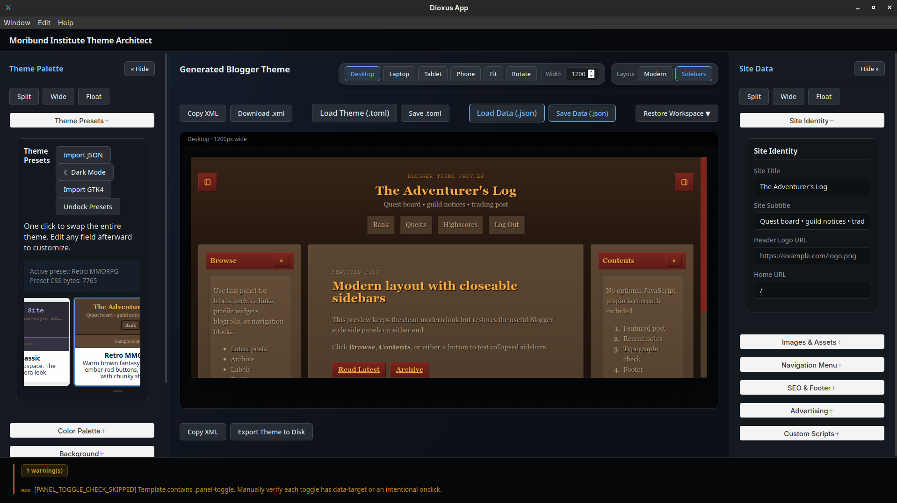

# Moribund Blogger Theme Editor

A low-level **Blogger XML generator** with a modern, reactive GUI built
in Rust using Dioxus.\
Design, customize, and export complete Blogger themes without ever
touching raw XML.

------------------------------------------------------------------------

## ✨ Overview

Moribund Blogger Theme Editor replaces the traditional monolithic
`template.xml` workflow with a modular system.\
Instead of editing a single massive file, you work with structured
components that compile into a final Blogger-ready theme.

The result: faster iteration, safer edits, and a dramatically improved
developer experience.

------------------------------------------------------------------------

## 🚀 Core Features

### 🧩 Modular XML Generation

-   Build themes from discrete template parts:
    -   `meta.xml`
    -   `css.xml`
    -   `header.xml`
    -   `sidebars.xml`
-   Automatically composes a complete Blogger template
-   Injects:
    -   SEO metadata
    -   Typography systems
    -   Background systems
    -   Widget sockets

------------------------------------------------------------------------

### 🎨 GTK Theme Integration

-   Import themes from:
    -   WhiteSur
    -   Adwaita
    -   Nord
-   Parses:
    -   `gtk-4.0`
    -   `gtk-3.0`
    -   `gnome-shell`
-   Converts SVG assets into CSS data URIs
-   Maps GTK variables directly into your Blogger theme

------------------------------------------------------------------------

### 🖥️ Fluid Workspace UI

-   Built with **Dioxus (Rust)**
-   Features:
    -   Glassmorphic panels
    -   Collapsible sections
    -   Floating draggable windows
-   Includes:
    -   Deep-space grid preview canvas
    -   Responsive viewport scaling

------------------------------------------------------------------------

### ⚠️ Real-Time Diagnostics

-   Live validation of template structure
-   Detects:
    -   Missing bindings
    -   Invalid panel toggles
    -   Structural inconsistencies
-   Prevents broken exports

------------------------------------------------------------------------

### 🎮 Thematic Presets

-   Includes built-in presets like:
    -   **Retro MMORPG**
-   Features:
    -   Warm brown panels
    -   Ember-red accents
    -   Gold typography with heavy shadows

------------------------------------------------------------------------

## 🧠 Technical Architecture

### Frontend Engine

-   Rust + Dioxus
-   Component-driven UI system
-   Custom drag-and-drop window manager

### Rendering Engine

-   Merges `ThemeConfig` into template skeleton
-   Produces:
    -   Live preview HTML
    -   Final Blogger XML

### State System

-   Signal-based reactive state
-   Serialized into TOML
-   Embedded into exported XML for restoration

### CSS System

-   Dark-first design
-   Custom scrollbars
-   BEM-style structure

------------------------------------------------------------------------

## 🛠️ Getting Started

### Prerequisites

-   Rust toolchain → https://rustup.rs
-   Dioxus CLI:

``` bash
cargo install dioxus-cli
```

### Run Locally

``` bash
git clone https://github.com/MoribundInstitute/mor_blogger_theme_editor.git
cd mor_blogger_theme_editor
dx serve --hot-reload
```

------------------------------------------------------------------------

## 🔄 Workflow

1.  **Design**\
    Configure layout, colors, typography, and metadata

2.  **Preview**\
    Test across desktop, tablet, and mobile

3.  **Export**\
    Copy generated XML into Blogger

4.  **Restore**\
    Paste exported XML back into the editor to recover your workspace

------------------------------------------------------------------------

## 📁 Project Structure

    src/
    ├── app.rs              # Application root
    ├── render.rs           # Theme rendering engine
    ├── rehydration.rs      # State encoding/decoding
    ├── config.rs           # Theme data structures
    ├── defaults.rs         # Default theme presets
    ├── gtk_theme.rs        # GTK parser
    └── ui/                 # Editor components

------------------------------------------------------------------------

## 👤 Author

Developed by **Murdoch**\
Moribund Institute

------------------------------------------------------------------------

## 📄 License

MIT License
