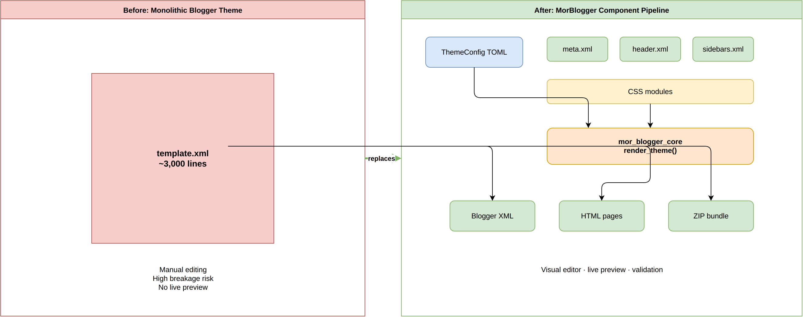
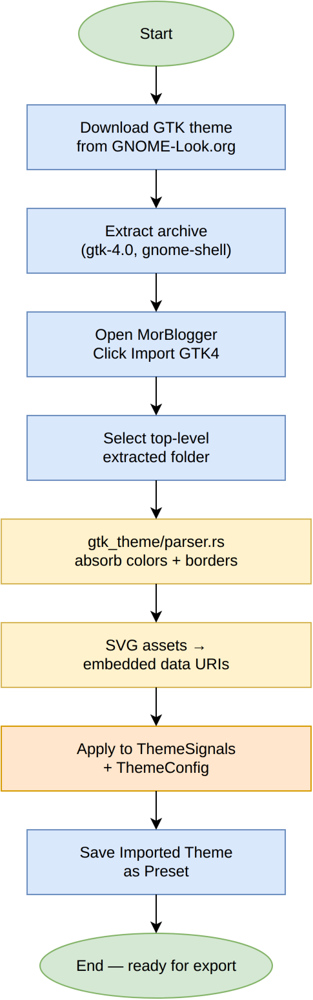
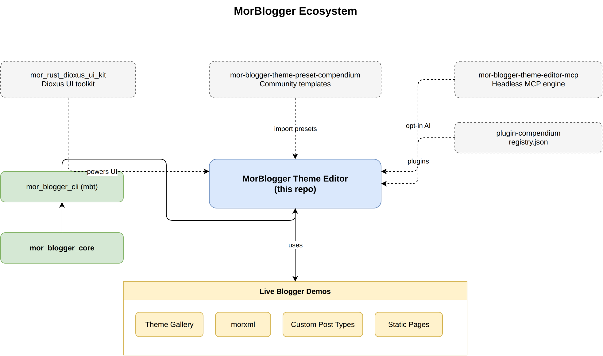
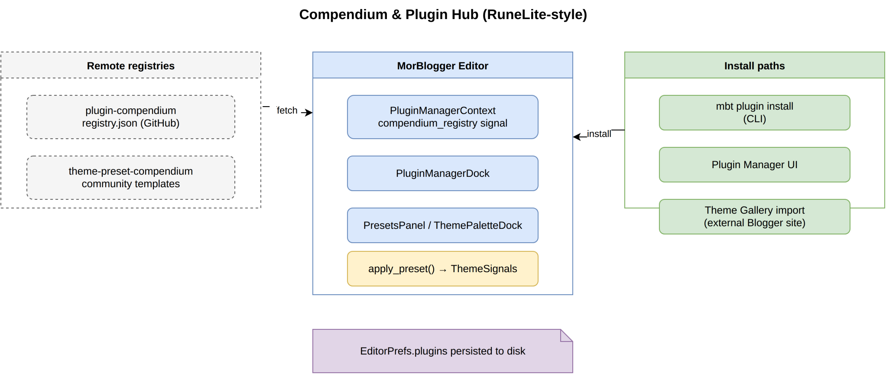
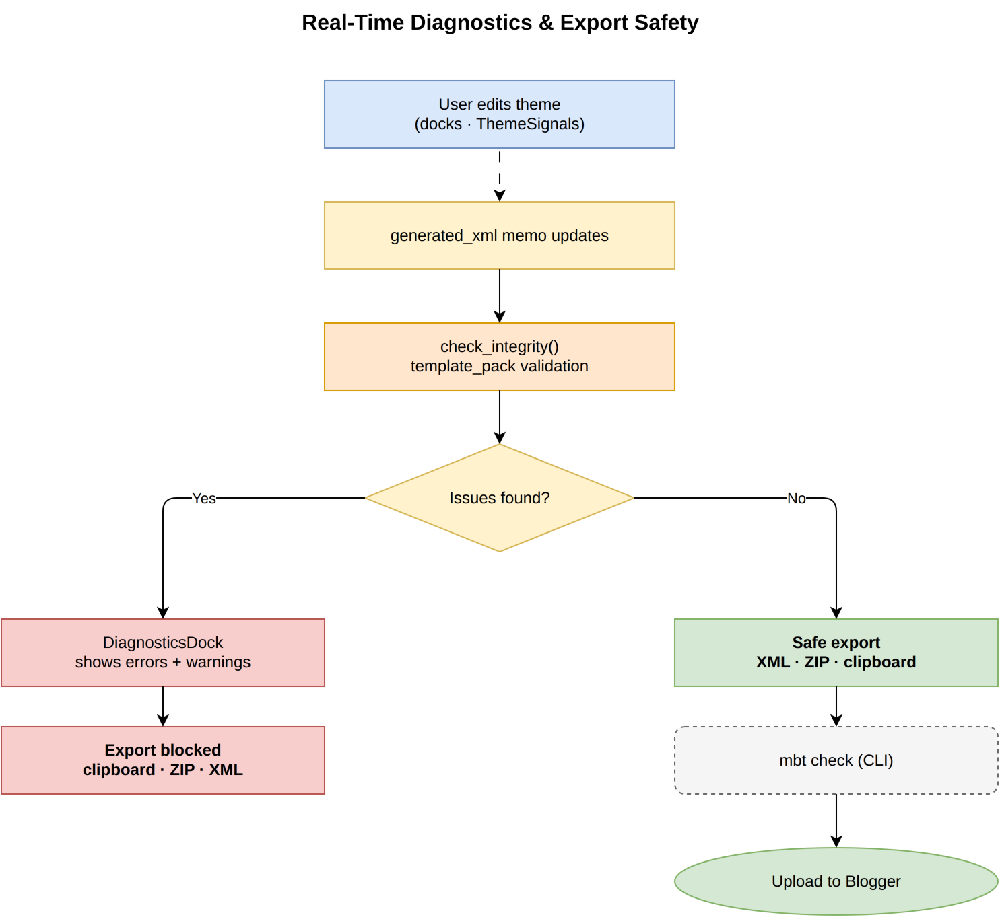
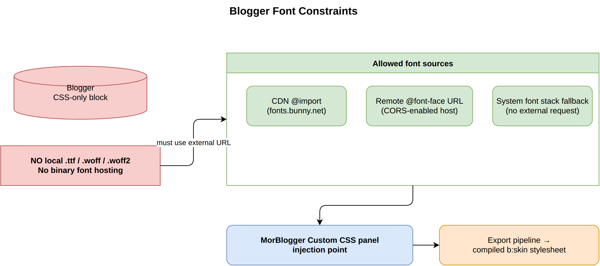
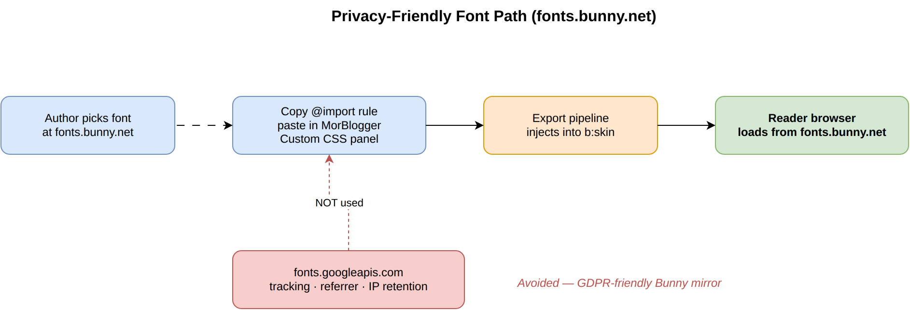
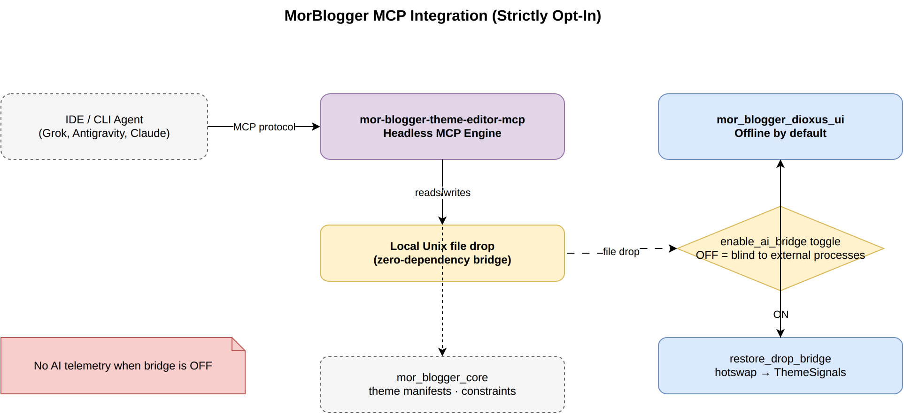
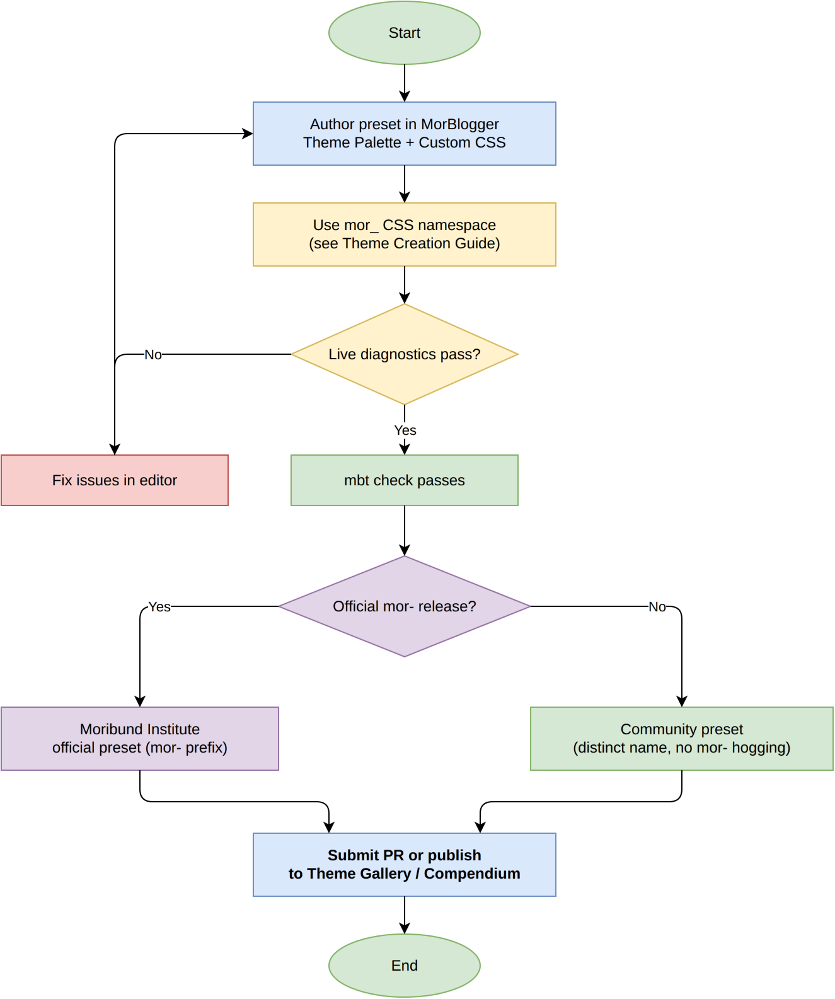

<div align="center">

# 🏛️ MorBlogger Theme Editor

A visual Blogger theme builder that handles the ugly XML machinery for you.<br>
Design your theme in a modern Rust-powered desktop app, then export clean Blogger XML, matching HTML pages, or a ready-to-upload ZIP without manually touching raw template code.

[](LICENSE)
[](https://www.rust-lang.org/)
[](https://dioxuslabs.com/)
[](CONTRIBUTING.md)


</div>

---

# 🌍 Why Do We Exist?

We want to make Blogger GUI editing software so easy that even 95-year-old, technologically illiterate grandmothers could use it. I'm thinking we should lean into [skeuomorphism](https://en.wikipedia.org/wiki/Skeuomorph) to maximize the software's intuitiveness. Blogger could be an ideal platform for older people because the content management system is already fairly intuitive, while we could help them make their blogs look good.

Those of us who are more technically inclined should be willing to sacrifice some of our time creating presets, widgets, & other tools (and post them on the various compendiums this GUI software will manage in a similar fashion to [RuneLite plugins](https://github.com/runelite/plugin-hub)) so that people who may be technologically illiterate, but have other interesting hobbies, such as maintaining an orchard of [heritage apples](https://en.wikipedia.org/wiki/Lost_Apple_Project) or translating [Beowulf](https://en.wikipedia.org/wiki/Beowulf) into [Old Scots](https://en.wikipedia.org/wiki/Early_Scots), can more easily manage a blog without worrying about subscription fees and similar obstacles.

Blogger could also become a free, highly customizable learning management system (LMS) for teachers worldwide. Imagine schools, colleges, and independent educators being able to build their own free versions of Khan Academy, complete with built-in spaced repetition software. That's the ultimate end goal.

We're experimenting with several LMS options and identity verification methods — Syncthing, OAuth 2.0, Rauthy, and other approaches — in the experimental vault below. We also take loose inspiration from [rebane2001/xikipedia](https://github.com/rebane2001/xikipedia) because we want educational content to stay portable and community-owned rather than locked inside one platform.

🔗 **Experimental vault:** [MoribundInstitute/mor_lms_vault](https://github.com/MoribundInstitute/mor_lms_vault)

Google could also foster a symbiotic relationship with Blogger by generating significant revenue through integrated ads. While the GUI editor includes several advertising options, they are left off by default, as traditional banner ads often degrade the user experience. Ideally, Google would introduce a Patreon-style monetization platform for Blogger, or perhaps an opt-in system for LLM training to support their platform.


*Star Wars: Return of the Jedi © Lucasfilm Ltd. Google logo ™ Google LLC. Used here as parody/meme. Repo code is MIT licensed third-party image, not covered by MIT.*

## The Problem

Editing a custom Blogger theme means wrestling with a monolithic, 3,000-line `template.xml` file. 

## ✨ The Solution

The MorBlogger Theme Editor replaces the monolith with a component-driven pipeline. You work visually with structured modules in a desktop UI. When you are ready, the Rust engine safely compiles your palettes, typography, and modular CSS into a single bulletproof XML file, matching HTML pages, or a ZIP archive containing the whole lot, ready for upload.



GTK4 desktop themes can supply more than colors: Rust code converts bundled SVGs into data URIs, and CSS maps them onto Blogger-safe hooks so icons, decorations, and UI chrome can ship inside the theme without extra HTTP requests. GNOME-Look [icon/SVG theme packs](https://www.gnome-look.org/browse?cat=277&ord=rating) are on the roadmap for the same pipeline.

---

## 🚀 Core Capabilities

### 🧩 Building with Blocks (Modular XML Assembly)
* **No More Giant Files:** Instead of wrestling with one massive 3,000-line template file, you build your theme using small, easy-to-manage blocks like a header, a sidebar, and a footer. 
* **Clean Code Assembly:** Behind the scenes, the engine takes all your individual style rules and stitches them together perfectly. It keeps the final code lean and prevents messy errors.
* **Automatic Wiring:** The software handles the boring stuff for you. It automatically connects search engine (SEO) settings, text sizes, and widget spaces without you having to write the code.


See also: [CSS Assembly Pipeline](docs/CSS_PIPELINE.md)

### 🎨 Stealing Colors from Linux (GTK Desktop Integration)
* **Match Your Desktop:** If you use Linux, you can import color schemes and visual styles directly from popular desktop themes like Adwaita, Nord, or WhiteSur.
* **Built-in Graphics:** When you add icons or vector graphics (SVGs), the software converts them into text and embeds them directly into your theme code. This makes your blog load much faster because it doesn't have to ask another website to provide the images.

### 🖥️ The Visual Workspace (Fluid UI)
* **Lightweight Interface:** The app's interface is built on a fast, modern toolkit called Dioxus 0.7.
* **Flexible Window Borders:** The app's window borders magically adapt to look perfect whether you are on Windows, a Mac, or using a specialized, keyboard-only Linux setup.
* **Preview X-Ray:** Shift+Click an element in the live preview to jump straight to the dock panel that edits it (typography, icons, blocks, and more).
* **Live Preview:** A two-way DOM morpher updates the preview as you edit colors, fonts, and text — without destructive iframe reloads or scroll-jumping.


---

## 🎨 How to Import Native GTK4 Linux Themes

MorBlogger can steal colors, borders, and UI icons directly from native Linux GTK desktop themes and convert them into Blogger templates.



See also: [GTK Theme Parsing](docs/GTK_PARSER.md)

1. Go to [GNOME-Look.org](https://www.gnome-look.org/browse/).
2. Download any GTK3/GTK4 theme archive (e.g., `Mojave-Dark-alt.tar.xz`).
3. Extract the archive on your computer.
4. Open MorBlogger Theme Editor and click **Import GTK4 Theme**.
5. Select the **top-level extracted folder** (the folder that contains `gtk-4.0`, `gnome-shell`, etc.).
6. The engine will absorb the CSS and SVG data URIs. Click **Save Imported Theme as Preset** to keep it.

---

# 🛠️ Getting Started

MorBlogger Theme Editor is a Rust-powered desktop app for building, editing, validating, and packaging Blogger themes.

## Prerequisites

### 1. Install Rust

Install the Rust toolchain from:

- https://rustup.rs/

Verify installation:

```bash
rustc --version
cargo --version
```

### 2. Install the Dioxus CLI

The graphical editor is built with Dioxus.

```bash
cargo install dioxus-cli
```

Verify installation:

```bash
dx --version
```

---

## Option A: Launch the Visual Editor

The visual workspace provides:

- Live preview workflows
- Hot reloading during development
- Theme configuration editing
- Visual design tooling
- Plugin and workspace integration (via Plugin Manager)

From the project root:

```bash
cd mor_blogger_dioxus_ui
dx serve
```

This opens the **native desktop window** (Dioxus desktop target — not a browser tab).

---

## Option B: Use the Command-Line Tool (mbt)

If you prefer a terminal workflow, use the `mbt` utility.

Build the release executable:

```bash
cargo build --release -p mor_blogger_cli
```

The binary will be located at:

```text
target/release/mbt
```

### Initialize a Project

Create a new theme workspace:

```bash
./target/release/mbt init
```

### Validate a Theme

Check XML syntax and catch Blogger import issues before deployment:

```bash
./target/release/mbt check
```

### Build a Blogger Theme

Generate the final Blogger-compatible XML output:

```bash
./target/release/mbt render -i workspace.toml
```

### Create a Distribution Bundle

Build the theme and package supporting assets:

```bash
./target/release/mbt bundle
```

---

## Typical Development Workflow

```bash
# 1. Create or open a workspace
mbt init

# 2. Edit visually
cd mor_blogger_dioxus_ui && dx serve

# 3. Validate theme output
mbt check

# 4. Build final XML
mbt render -i workspace.toml

# 5. Package for distribution
mbt bundle
```


---

## Project Goals

MorBlogger Theme Editor aims to provide:

- A modern visual Blogger theme editor
- Rust-first architecture
- GUI and CLI workflows
- Validation before Blogger import
- Reusable theme components
- Extensible plugin support
- Static export and packaging tools

---

## Troubleshooting

### Dioxus CLI Not Found

Install or reinstall:

```bash
cargo install dioxus-cli
```

### Build Failures

Update Rust:

```bash
rustup update
```

Clean and rebuild:

```bash
cargo clean
cargo build
```

### Blogger Import Errors

Run:

```bash
mbt check
```

before importing generated XML into Blogger.

---

**Repository:** https://github.com/MoribundInstitute/mor_blogger_theme_editor

---

## Architecture: Bring Your Own Frontend (BYOF)

MorBlogger splits the software into a reusable **Socket** (window chrome, docks, activity bar) and a swappable **Plug** (Blogger-specific preview, export, and site data). The theme engine stays in `mor_blogger_core`; both the Dioxus UI and `mbt` CLI call into it.


### The Three Main Pieces

* **1. The Engine (`mor_blogger_core`):** Headless logic — reads settings, stitches CSS, validates XML. No buttons or windows.
* **2. The Visual Workspace (`mor_blogger_dioxus_ui`):** The desktop UI you click on. Socket-and-plug layout:
  * **Socket (`MorLayoutChrome`):** Main window, dock zones, activity bar, floating panels.
  * **Plug (`BloggerWorkspace`):** Blogger preview, export, and workbench views. Forking for another host (e.g. Neocities) means swapping this plug, not rebuilding the shell.
* **3. The Command Line (`mor_blogger_cli` / `mbt`):** Terminal workflow for init, check, render, and bundle.


### Socket & Plug in Plain English

| Piece | What it is | Key types |
| --- | --- | --- |
| **Socket** | Generic editor shell — tabs, docks, popups | `MorLayoutChrome`, `DockZone`, `ActivityBar` |
| **Plug** | Domain brains — what you are actually editing | `BloggerWorkspace` today; `NeocitiesWorkspace` is the fork example in the diagram |
| **Promise** | Swap the plug, keep the socket | Fixes in Blogger logic don't require rewriting dock chrome |

Deep dive: [Architecture Overview](docs/ARCHITECTURE.md)

---

## 🌐 Ecosystem & Live Demos

MorBlogger sits in a larger toolchain of Rust UI kits, compendium repos, and optional MCP bridges:



### Core Libraries
- [MOR UI Kit](https://github.com/MoribundInstitute/mor_rust_dioxus_ui_kit) — The standalone Dioxus UI toolkit powering the editor shell.
- [Theme Preset Compendium](https://github.com/MoribundInstitute/mor-blogger-theme-preset-compendium) — Community JSON color and typography presets.



Browseable galleries and matched GitHub sources are listed in **The Compendiums** (next section). Two additional live demos showcase features without their own compendium repo:

- [Custom Post Types](https://morcustomposttypes.blogspot.com/) — advanced Blogger data tags and post routing.
- [Static Pages](https://morpages.blogspot.com/) — standalone page layouts.

## ⚠️ Real-Time Diagnostics
- **Live Validation:** The engine actively detects structural inconsistencies, missing bindings, or broken toggles before you export.
- **Export Safety:** Prevents broken XML from ever reaching your clipboard.



---

## 📦 The Compendiums

MorBlogger doesn't bake every preset, widget, and layout into the binary — that would bloat the app and bottleneck the whole ecosystem on one person's taste. Instead, the heavy stuff lives in community **compendiums**: open repositories that build themselves into browsable Blogger galleries ([RuneLite plugin-hub](https://github.com/runelite/plugin-hub) style). Browse the live gallery, copy a link or snippet, and paste it straight into the GUI.

Each compendium is a matched pair: a **GitHub repo** (the source of truth) and a **Blogger frontend** (the gallery you browse).

| Compendium | What it holds | Live gallery | Source |
| --- | --- | --- | --- |
| **Full Themes** | Complete, ready-to-upload Blogger XML themes | [mor-theme-compendium.blogspot.com](https://mor-theme-compendium.blogspot.com/) | [mor-blogger-full-theme-compendium](https://github.com/MoribundInstitute/mor-blogger-full-theme-compendium) |
| **Theme Presets** | JSON color &amp; typography presets — the *skin* you hot-swap | [morbloggerpresetcompendium.blogspot.com](https://morbloggerpresetcompendium.blogspot.com/) | [mor-blogger-theme-preset-compendium](https://github.com/MoribundInstitute/mor-blogger-theme-preset-compendium) |
| **Widgets** | Installable Blogger gadgets and their install-XML blueprints | [mor-widgets-compendium.blogspot.com](https://mor-widgets-compendium.blogspot.com/) | [mor-blogger-widget-compendium](https://github.com/MoribundInstitute/mor-blogger-widget-compendium) |
| **XML Structures** | Raw layout *bones* — headers, footers, grids — that adapt to your active theme variables (the *skeleton*) | [morxml.blogspot.com](https://morxml.blogspot.com/) | [mor-xml-compendium](https://github.com/MoribundInstitute/mor-xml-compendium) |

Think **skin vs. skeleton**: Theme Presets restyle what you already have, XML Structures swap the underlying bones, Widgets drop in self-contained gadgets, and Full Themes hand you the whole package at once.

### 🧪 Live demos (no standalone compendium)

These Blogger sites showcase specific capabilities rather than hosting a browsable collection:

- [Custom Post Types](https://morcustomposttypes.blogspot.com/) — advanced Blogger data tags and post routing.
- [Static Pages](https://morpages.blogspot.com/) — standalone page layouts.

> **Naming convention:** the `mor-` prefix is reserved for official Moribund Institute releases so we don't hog generic community names like "Modern Editorial." Folder slugs are path identifiers — display names are where you get creative.

---

## 📚 Documentation & Deep Dives

Whether you want to understand the reactive state engine or submit your own preset to a compendium, start here:

- [Architecture Overview](docs/ARCHITECTURE.md) — Rust rendering engine, Dioxus state, docks, and ThemeSignals (with diagrams).
- [The CSS Assembly Pipeline](docs/CSS_PIPELINE.md) — The `mor_` namespace and how modular CSS is stitched together.
- [Creating a Theme Preset](docs/THEME_CREATION.md) — Tokens, palettes, and compendium submission.
- [GTK Theme Parsing](docs/GTK_PARSER.md) — How Linux desktop themes become Blogger variables.

Editable diagram sources live in [`docs/diagrams/`](docs/diagrams/) in this repo. A mirrored copy also lives in the atlas [`diagrams/shared/`](https://github.com/MoribundMurdoch/mor_blogger_theme_editor_atlas/tree/main/diagrams/shared) folder for contributors who work from the codebase tour repo.

### Codebase atlas (contributors)

For a guided tour of this repo — crate boundaries, Dioxus bootstrap, folder maps, and per-source file cards — see the companion [**mor_blogger_theme_editor_atlas**](https://github.com/MoribundMurdoch/mor_blogger_theme_editor_atlas):

- [Guides index](https://github.com/MoribundMurdoch/mor_blogger_theme_editor_atlas/blob/main/atlas/guides/README.md) — recommended reading order
- [01 — Crate map (BYOF)](https://github.com/MoribundMurdoch/mor_blogger_theme_editor_atlas/blob/main/atlas/guides/01-crate-map.md)
- [07 — Repo folder map](https://github.com/MoribundMurdoch/mor_blogger_theme_editor_atlas/blob/main/atlas/guides/07-repo-folder-map.md)
- [Master index (305 file cards)](https://github.com/MoribundMurdoch/mor_blogger_theme_editor_atlas/blob/main/atlas/INDEX.md)

## 🧰 Resources
Need assets or reference material for your theme? Use these external tools:

- **Icons:** [Google Material Symbols](https://fonts.google.com/icons) (Download as SVG, upload via MorBlogger UI)
- **Icons:** [Lucide](https://lucide.dev/) (Clean, neutral SVG icons)
- **Blogger API:** [Official XML Documentation](https://developers.google.com/blogger)
- **Asset Generation:** [halftone.tools](https://halftone.tools) (Free, browser-based print-effects workshop. Perfect for generating retro dithered background plates or custom vector SVGs for the theme dictionary).

---

## Custom Fonts & Privacy CDNs

### The Blogger Limitation

Google Blogger only allows you to upload CSS code to your theme file. It does not allow you to upload raw font files (like `.ttf` or `.woff2`) directly to their servers. 

Because of this, if you want to use a custom font, your theme has to load it from an external website link.



### The Privacy Alternative

Many people use Google Fonts, but those can track your readers. Instead, we recommend using [fonts.bunny.net](https://fonts.bunny.net). It has the exact same font catalog as Google, but it strips out the tracking pixels and IP logging, keeping your readers' privacy safe.



1. Pick your font family at [fonts.bunny.net](https://fonts.bunny.net).
2. Copy the generated `@import` rule.
3. Paste it into the **MorBlogger Custom CSS** panel.

```css
@import url('https://fonts.bunny.net/css?family=inter:400,700');

:root {
  --font-body: 'Inter', system-ui, sans-serif;
}
```

When you export your theme, the app automatically drops this code into the final file. No Google tracking requests will ever hit your readers' browsers.

Custom font rules pass through the internal normalization pipeline before export — see [DECISIONS.md](DECISIONS.md).


### Hosting Your Own Fonts

If you bought a specific font or are using a rare one not found on Bunny Fonts, you have to upload the actual font file (like `.ttf`) to a web host yourself.

**The Security Padlock Problem:** Some web hosts put a "security padlock" (called CORS) on their files to stop other websites from stealing their bandwidth. If you upload your font file to a strict host, it will silently fail to load on your blog, and your browser will just show a boring default font instead.

To avoid this, we recommend uploading your font files to a free GitHub Pages account, as they leave the padlock open by default.

```css
@font-face {
  font-family: 'Brand Serif';
  src: url('https://youruser.github.io/fonts/BrandSerif-Regular.ttf') format('truetype');
  font-weight: 400;
  font-style: normal;
  font-display: swap;
}

:root {
  --font-heading: 'Brand Serif', Georgia, serif;
}
```

Just paste the `@font-face` block and your typography overrides into the MorBlogger Custom CSS panel, and the app will handle the rest.

---

## 🤖 AI & LLM Integration (Strictly Opt-In)



For developers and power users who want AI assistance without embedding a runtime inside the GUI, we maintain a standalone, headless MCP (Model Context Protocol) server in a separate repo.

By running the **MorBlogger MCP Engine**, you can connect your CLI agent (like Antigravity or Grok) or desktop IDE directly to MorBlogger core. The AI can read your theme manifests, respect structural constraints, and hot-reload your active UI workspace when the AI bridge toggle is on.

Communication between the UI and the MCP server uses a local file-drop bridge (see `restore_drop_bridge` in the Dioxus app). Install plugins via `mbt inject` or the in-app Plugin Manager.

🔗 **Get the MCP Engine:** [mor-blogger-theme-editor-mcp](https://github.com/MoribundInstitute/mor-blogger-theme-editor-mcp)

*Note: This is strictly opt-in. The core MorBlogger UI is offline and local by default. If the AI bridge toggle is off in your preferences, the editor ignores external MCP processes.*

---

## 🤝 Contributing
The Moribund Institute welcomes contributions! If you have built a beautiful, robust theme preset using MorBlogger, we would love to add it to a compendium or feature it on the [Theme Gallery](https://mor-theme-compendium.blogspot.com/).



To leave naming space open for the community (so we don't hog generic names like "Modern Editorial" or "Web 2.0"), the Moribund Institute reserves the `mor-` prefix for our official theme releases. 

Whether you are submitting a PR to share your preset publicly or just building for yourself, please ensure your internal CSS and variables follow the `mor_` namespacing guidelines outlined in the [Theme Creation Guide](docs/THEME_CREATION.md).

## License
Published under the MIT License. 

The Moribund Institute doesn't strictly care about copyright (it's often an arbitrary barrier to the acceleration of ideas), but we do have egos, so attribution is always appreciated!

<div align="center">
  <br>
  <b>Developed by Murdoch</b><br>
  <i>The Moribund Institute</i>
</div>

