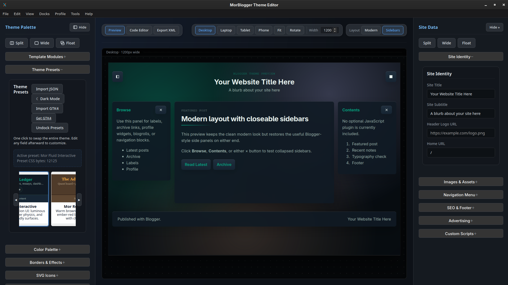
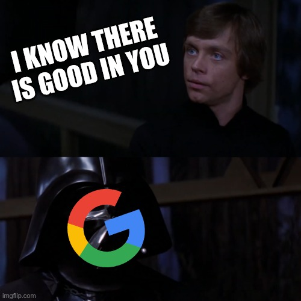

<div align="center">

# 🏛️ MorBlogger GUI Theme Builder

A visual Blogger theme builder that handles the ugly XML machinery for you.<br>
Design your theme in a modern Rust-powered interface, then export clean Blogger XML, matching HTML pages, or a ready-to-upload ZIP without manually touching raw template code.

[](LICENSE)
[](https://www.rust-lang.org/)
[](https://dioxuslabs.com/)
[](CONTRIBUTING.md)



</div>


---

# 🌍 Why Do We Exist?

We want to make Blogger GUI editing software so easy that even 95-year-old, technologically illiterate grandmothers could use it. I'm thinking we should lean into [skeuomorphism](https://en.wikipedia.org/wiki/Skeuomorph) to maximize the software's intuitiveness. Blogger could be an ideal platform for older people because the content management system is already fairly intuitive, while we could help them make their blogs look good.

Those of us who are more technically inclined should be willing to sacrifice some of our time creating presets, widgets, & other tools (and post them on the various compendiums this GUI software will manage in a similiar fashion to [RuneLite plugins](https://github.com/runelite/plugin-hub)) so that people who may be technologically illiterate, but have other interesting hobbies, such as maintaining an orchard of [heritage apples](https://en.wikipedia.org/wiki/Lost_Apple_Project) or translating [Beowulf](https://en.wikipedia.org/wiki/Beowulf) into [Old Scots](https://en.wikipedia.org/wiki/Early_Scots), can more easily manage a blog without worrying about subscription fees and similar obstacles.

Blogger could also become a free, highly customizable learning management system (LMS) for teachers worldwide. Imagine schools, colleges, and independent educators being able to build their own free versions of Khan Academy, complete with built-in spaced repetition software. That's the ultimate end goal.

We're experimenting with several LMS options and identity verification methods: Syncthing, Web3, whatnot, OAuth 2.0, Rauthy, you name it. We also take loose inspiration from [rebane2001/xikipedia](https://github.com/rebane2001/xikipedia) because we really want educational content to become decentralized skinner boxes.

🔗 **Experimental vault:** [MoribundInstitute/mor_lms_vault](https://github.com/MoribundInstitute/mor_lms_vault)

Google could also foster a symbiotic relationship with Blogger by generating significant revenue through integrated ads. While the GUI editor includes several advertising options, they are left off by default, as traditional banner ads often degrade the user experience. Ideally, Google would introduce a Patreon-style monetization platform for Blogger, or perhaps an opt-in system for LLM training to support their platform.



*Star Wars: Return of the Jedi © Lucasfilm Ltd. Google logo ™ Google LLC. Used here as parody/meme. Repo code is MIT licensed third-party image, not covered by MIT.*

## The Problem

Editing a custom Blogger theme means wrestling with a monolithic, 3,000-line `template.xml` file. 

## ✨ The Solution

The MorBlogger GUI Theme Builder replaces the monolith with a component-driven pipeline. You work visually with structured modules in a desktop UI. When you are ready, the Rust engine safely compiles your palettes, typography, and modular CSS into a single bulletproof XML file, matching HTML pages, or a ZIP archive containing the whole lot, ready for upload.


The theming is also hype because we have Rust code that converts GTK4 SVGs into Data URIs. Then, with a bit of behind-the-scenes CSS magic, we can make all sorts of SVG whatnot appear on your blog. I think we could get it to work for these later too: [GNOME-Look SVG Themes](https://www.gnome-look.org/browse?cat=277&ord=rating).

---

## 🚀 Core Capabilities

### 🧩 Building with Blocks (Modular XML Assembly)
* **No More Giant Files:** Instead of wrestling with one massive 3,000-line template file, you build your theme using small, easy-to-manage blocks like a header, a sidebar, and a footer. 
* **Clean Code Assembly:** Behind the scenes, the engine takes all your individual style rules and stitches them together perfectly. It keeps the final code lean and prevents messy errors.
* **Automatic Wiring:** The software handles the boring stuff for you. It automatically connects search engine (SEO) settings, text sizes, and widget spaces without you having to write the code.


See also: [CSS Assembly Pipeline](docs/CSS_PIPELINE.md)

### 🎨 Stealing Colors from Linux (GTK Desktop Integration)
* **Match Your Desktop:** If you use Linux, you can import color schemes and visual styles directly from popular desktop themes like Adwaita, Nord, or WhiteSur.
* **Built-in Graphics:** When you add icons or vector graphics (SVGs), the software converts them into text and embeds them directly into your theme code. This makes your blog load much faster because it doesn't have to ask another website to provide the images.

### 🖥️ The Visual Workspace (Fluid UI)
* **Lightweight Interface:** The app's interface is built on a fast, modern toolkit called Dioxus 0.7.
* **Flexible Window Borders:** The app's window borders magically adapt to look perfect whether you are on Windows, a Mac, or using a specialized, keyboard-only Linux setup.
* **Smart Code Locator:** When you click on a visual part of your theme (like the header), the code editor instantly scrolls to and highlights the exact line of code you need to change. 
* **Instant Updates:** The program runs on Rust, meaning your live previews and edits update instantaneously without any annoying loading screens.


---

## 🎨 How to Import Native GTK4 Linux Themes

Moribund Architect can steal colors, borders, and UI icons directly from native Linux GTK Desktop themes and convert them into Blogger templates.


See also: [GTK Theme Parsing](docs/GTK_PARSER.md)

1. Go to [GNOME-Look.org](https://www.gnome-look.org/browse/).
2. Download any GTK3/GTK4 theme archive (e.g., `Mojave-Dark-alt.tar.xz`).
3. Extract the archive on your computer.
4. Open Moribund Architect and click **Import GTK4**.
5. Select the **top-level extracted folder** (It should be the folder that contains `gtk-4.0`, `gnome-shell`, etc. inside it). 
6. The engine will instantly absorb the CSS and SVG data URIs. Click **Save Imported Theme as Preset** to keep it!

---

# 🛠️ Getting Started with Mor Blogger Theme Editor

Welcome to **Mor Blogger Theme Editor**, a Rust-powered visual environment for building, editing, validating, and packaging Blogger themes.

## Prerequisites

### 1. Install Rust

Install the Rust toolchain from:

- https://rustup.rs/

Verify installation:

```bash
rustc --version
cargo --version
```

### 2. Install the Dioxus CLI

The graphical editor is built with Dioxus.

```bash
cargo install dioxus-cli
```

Verify installation:

```bash
dx --version
```

---

# Option A: Launch the Visual Editor

The visual workspace provides:

- Live preview workflows
- Hot reloading during development
- Theme configuration editing
- Visual design tooling
- Future plugin and workspace integration

From the project root:

```bash
cd mor_blogger_dioxus_ui
dx serve
```

Then open the local address displayed by Dioxus in your browser.

---

# Option B: Use the Command-Line Tool (mbt)

If you prefer a terminal workflow, use the `mbt` utility.

Build the release executable:

```bash
cargo build --release -p mor_blogger_cli
```

The binary will be located at:

```text
target/release/mbt
```

## Initialize a Project

Create a new theme workspace:

```bash
./target/release/mbt init
```

## Validate a Theme

Check XML syntax and catch Blogger import issues before deployment:

```bash
./target/release/mbt check
```

## Build a Blogger Theme

Generate the final Blogger-compatible XML output:

```bash
./target/release/mbt build
```

## Create a Distribution Bundle

Build the theme and package supporting assets:

```bash
./target/release/mbt bundle
```

---

# Typical Development Workflow

```bash
# 1. Create or open a workspace
mbt init

# 2. Edit visually
dx serve

# 3. Validate theme output
mbt check

# 4. Build final XML
mbt build

# 5. Package for distribution
mbt bundle
```


---

# Project Goals

Mor Blogger Theme Editor aims to provide:

- A modern visual Blogger theme editor
- Rust-first architecture
- GUI and CLI workflows
- Validation before Blogger import
- Reusable theme components
- Extensible plugin support
- Static export and packaging tools

---

# Troubleshooting

## Dioxus CLI Not Found

Install or reinstall:

```bash
cargo install dioxus-cli
```

## Build Failures

Update Rust:

```bash
rustup update
```

Clean and rebuild:

```bash
cargo clean
cargo build
```

## Blogger Import Errors

Run:

```bash
mbt check
```

before importing generated XML into Blogger.

---

# Repository

https://github.com/MoribundInstitute/mor_blogger_theme_editor

# 🧩 BYOF Socket & Plug UI Pattern – Plain English Breakdown

This diagram describes a smart way to build software called the **"BYOF" (Bring Your Own Functionality) pattern**. 

Instead of building one big, messy program, the developers split the app into two main parts: a **Socket** (the skeleton) and a **Plug** (the brains). 

Here is what all the technical terms in the diagram actually mean:

---

## 1. The Socket (Left Side - Blue Box)
**Tagline:** *"The generic, reusable skeleton."*

This is the core engine of the program. It doesn't care *what* you are building; it just knows *how* to manage windows, tabs, and panels. 

**Jargon Breakdown:**

- **`MorLayoutChrome`** → **"The Main Window"** 
  - *Plain English:* This is the base application window that opens on your screen. It holds everything else together.

- **`DockZone + dock_chrome`** → **"The Docking System"** 
  - *Plain English:* This is the software that lets you organize panels, tabs, and sidebars. It decides how borders are drawn, how tabs stack up, and where grids sit on the page. 

- **`ActivityBar + FloatingWindowManager`** → **"The Navigation & Popup System"** 
  - *Plain English:* The ActivityBar is the skinny sidebar with buttons (like "Save" or "Settings"). The FloatingWindowManager handles windows that can be dragged anywhere on the screen (like a floating preview pane).

---

## 2. The Plug (Right Side - Green Box)
**Tagline:** *"The domain-specific brains."*

This is where the actual *content* lives. The Socket provides the empty rooms; the Plug decides what furniture goes inside them.

**Jargon Breakdown:**

- **`BloggerWorkspace (current)`** → **"The Blogger Editor"** 
  - *Plain English:* This is the currently installed plug. It contains all the specific code needed to edit Google Blogger themes.

- **`Preview · export · site data`** → **"Blogger-specific logic"** 
  - *Plain English:* These are the actual tools you use: generating live previews of your theme, exporting the final code, and pulling data from Blogger. 

- **`NeocitiesWorkspace (fork example)`** → **"A Future Use Case"** 
  - *Plain English:* The dotted outline shows a potential future plan. Someone could take the exact same **Socket** (blue box), swap out the Blogger logic, and create a theme editor for **Neocities** (a different website platform) without having to re-write the whole app.

---

## 3. The Yellow Box (Bottom Center)
**Tagline:** *"The core promise of this architecture."*

**Text:** *"Swap the plug, keep the socket — zero structural friction for forks."*

- **What "Structural Friction" means:** In regular programming, if you want to fork (copy and modify) an app, you usually have to dig through thousands of lines of messy code to change even a tiny thing. That is a painful, error-prone process (friction).
- **What this diagram promises:** Because the app is split into a "Socket" and a "Plug", a developer can copy the project, delete the green "Blogger" box, and write a brand-new green box for a different platform. The blue "Socket" doesn't change at all, meaning the new app gets a polished, fully-working interface for free. No friction!

---

## 4. The Connector: `"slots into"`

- **What it means:** The arrow shows that the right side (Plug) physically "plugs in" to the left side (Socket).
- **How it works:** The Socket leaves empty holes in its interface. The Plug provides specific tools to fill those holes. When you click a button on the Socket's activity bar, it triggers an action inside the Plug.

---

## 🚀 Why Build Software This Way?

1. **Less work for developers:** You only build the complex window engine (Socket) once.
2. **Easy to fork:** Anyone can copy this project to build a similar app for a different website (like Neocities or WordPress) without breaking the app.
3. **Bug-free updates:** Since the UI engine and the content logic are separate, fixing a bug in the Blogger code won't break the drag-and-drop window system.

---

---

## Architecture: Bring Your Own Frontend (BYOF)

This project uses a "Bring Your Own Frontend" (BYOF) design. This simply means we split the software into two main parts: a **Socket** (the skeleton) and a **Plug** (the brains). 

We do this so the logic that builds a blog theme isn't permanently glued to the interface you use to design it.


### The Three Main Pieces

* **1. The Engine (`mor_blogger_core`):** This is the pure logic heart of the software. It reads your settings, writes the CSS, and checks for errors. It has no buttons, no windows, and no interface at all.
* **2. The Visual Workspace (`mor_blogger_dioxus_ui`):** This is the graphical interface you actually click on and use. It uses a "Socket and Plug" design:
  * **The Socket (`MorLayoutChrome`):** The generic skeleton. It manages the main window, organizes your tabs, and draws the sidebars.
  * **The Plug (`BloggerWorkspace`):** The specific brains for Blogger. It contains the tools to preview and export Blogger themes. Because of this design, someone could easily copy this project, remove the Blogger plug, and insert a new plug to make a theme editor for a different website like Neocities—without having to rebuild the whole app from scratch.
* **3. The Command Line (`mor_blogger_cli` / `mbt`):** A lightweight terminal tool. For power users who prefer typing commands over clicking buttons, this lets you validate code or build themes directly from your computer's terminal.


Deep dive: [Architecture Overview](docs/ARCHITECTURE.md)

---

## 🌐 Ecosystem & Live Demos
The Architect is part of a larger ecosystem of tools and live examples:


### Core Libraries
- [MOR UI Kit](https://github.com/MoribundInstitute/mor_rust_dioxus_ui_kit) — The standalone, zero-bloat Dioxus UI toolkit powering this editor.
- [Theme Compendium](https://github.com/MoribundInstitute/mor-blogger-theme-preset-compendium) — The open-source collection of community-driven Blogger templates.


### Live Production Sites
See the exported themes running live on Blogger's infrastructure:
- [Theme Gallery](https://mor-theme-compendium.blogspot.com/) — To keep the app lean, theme presets that didn't meet my arbitary cut to be hosted locally within the app are hosted externally on a companion Blogger site. Users can browse the collection there, copy a preset, and import it directly into the GUI Blogger theme maker.
- [XML Architecture](https://morxml.blogspot.com/) — It's a place to share XML bits like Blog post sections, custom sidebars, custom footers, etc.
- [Custom Post Types](https://morcustomposttypes.blogspot.com/) — Demonstrating advanced Blogger data tags and post routing.
- [Static Pages](https://morpages.blogspot.com/) — Demonstrating standalone page layouts.

## ⚠️ Real-Time Diagnostics
- **Live Validation:** The engine actively detects structural inconsistencies, missing bindings, or broken toggles before you export.
- **Export Safety:** Prevents broken XML from ever reaching your clipboard.


---

## 📚 Documentation & Deep Dives
The Architect is designed to be extensible. Whether you want to understand the reactive state engine or submit your own preset to the Compendium, our documentation hub has you covered:

- [Architecture Overview](docs/ARCHITECTURE.md) — Rust rendering engine, Dioxus state, docks, and ThemeSignals (with diagrams).
- [The CSS Assembly Pipeline](docs/CSS_PIPELINE.md) — The `mor_` namespace and how modular CSS is stitched together.
- [Creating a Theme Preset](docs/THEME_CREATION.md) — Tokens, palettes, and compendium submission.
- [GTK Theme Parsing](docs/GTK_PARSER.md) — How Linux desktop themes become Blogger variables.

Editable diagram sources live in the atlas [`diagrams/shared/`](https://github.com/MoribundMurdoch/mor_blogger_theme_editor_atlas/tree/main/diagrams/shared) folder (canonical copy).

### Codebase atlas (contributors)

For a guided tour of this repo — crate boundaries, Dioxus bootstrap, folder maps, and per-source file cards — see the companion [**mor_blogger_theme_editor_atlas**](https://github.com/MoribundMurdoch/mor_blogger_theme_editor_atlas):

- [Guides index](https://github.com/MoribundMurdoch/mor_blogger_theme_editor_atlas/blob/main/atlas/guides/README.md) — recommended reading order
- [01 — Crate map (BYOF)](https://github.com/MoribundMurdoch/mor_blogger_theme_editor_atlas/blob/main/atlas/guides/01-crate-map.md)
- [07 — Repo folder map](https://github.com/MoribundMurdoch/mor_blogger_theme_editor_atlas/blob/main/atlas/guides/07-repo-folder-map.md)
- [Master index (305 file cards)](https://github.com/MoribundMurdoch/mor_blogger_theme_editor_atlas/blob/main/atlas/INDEX.md)

## 🧰 Resources
Need assets or reference material for your theme? Use these external tools:

- **Icons:** [Google Material Symbols](https://fonts.google.com/icons) (Download as SVG, upload via MorBlogger UI)
- **Icons:** [Lucide](https://lucide.dev/) (Clean, neutral SVG icons)
- **Blogger API:** [Official XML Documentation](https://developers.google.com/blogger)
- **Asset Generation:** [halftone.tools](https://halftone.tools) (Free, browser-based print-effects workshop. Perfect for generating retro dithered background plates or custom vector SVGs for the theme dictionary).

---

## 🤝 Contributing
The Moribund Institute welcomes contributions! If you have built a beautiful, robust theme preset using the Architect, we would love to add it to the default Compendium or feature it on the [Theme Gallery](https://mor-theme-compendium.blogspot.com/).


To leave naming space open for the community (so we don't hog generic names like "Modern Editorial" or "Web 2.0"), the Moribund Institute reserves the `mor-` prefix for our official theme releases. 

Whether you are submitting a PR to share your preset publicly or just building for yourself, please ensure your internal CSS and variables follow the `mor_` namespacing guidelines outlined in the [Theme Creation Guide](docs/THEME_CREATION.md).

## License
Published under the MIT License. 

The Moribund Institute doesn't strictly care about copyright (it's often an arbitrary barrier to the acceleration of ideas), but we do have egos, so attribution is always appreciated!

<div align="center">
  <br>
  <b>Developed by Murdoch</b><br>
  <i>The Moribund Institute</i>
</div>

---

## Custom Fonts & Privacy CDNs

### The Blogger Limitation

Google Blogger only allows you to upload CSS code to your theme file. It does not allow you to upload raw font files (like `.ttf` or `.woff2`) directly to their servers. 

Because of this, if you want to use a custom font, your theme has to load it from an external website link.


### The Privacy Alternative

Many people use Google Fonts, but those can track your readers. Instead, we recommend using [fonts.bunny.net](https://fonts.bunny.net). It has the exact same font catalog as Google, but it strips out the tracking pixels and IP logging, keeping your readers' privacy safe.


1. Pick your font family at [fonts.bunny.net](https://fonts.bunny.net).
2. Copy the generated `@import` rule.
3. Paste it into the **MorBlogger Custom CSS** panel.

```css
@import url('https://fonts.bunny.net/css?family=inter:400,700');

:root {
  --font-body: 'Inter', system-ui, sans-serif;
}
```

When you export your theme, the app automatically drops this code into the final file. No Google tracking requests will ever hit your readers' browsers.

All fonts you put into the app automatically pass through our internal engine to ensure they are formatted correctly — see DECISIONS.md.

### Hosting Your Own Fonts

If you bought a specific font or are using a rare one not found on Bunny Fonts, you have to upload the actual font file (like `.ttf`) to a web host yourself.

**The Security Padlock Problem:** Some web hosts put a "security padlock" (called CORS) on their files to stop other websites from stealing their bandwidth. If you upload your font file to a strict host, it will silently fail to load on your blog, and your browser will just show a boring default font instead.

To avoid this, we recommend uploading your font files to a free GitHub Pages account, as they leave the padlock open by default.

```css
@font-face {
  font-family: 'Brand Serif';
  src: url('https://youruser.github.io/fonts/BrandSerif-Regular.ttf') format('truetype');
  font-weight: 400;
  font-style: normal;
  font-display: swap;
}

:root {
  --font-heading: 'Brand Serif', Georgia, serif;
}
```

Just paste the `@font-face` block and your typography overrides into the MorBlogger Custom CSS panel, and the app will handle the rest.

---

## 🤖 AI & LLM Integration (Strictly Opt-In)


For developers and power users who want AI assistance without adding bloated Electron apps or embedded runtimes to the GUI, we maintain a standalone, headless MCP (Model Context Protocol) server.

By running the **MorBlogger MCP Engine**, you can connect your CLI agent (like Antigravity or Grok) or desktop IDE directly to the MorBlogger core. The AI can read your theme manifests, respect your structural constraints, and hot-reload your active UI workspace. 

Communication between the UI and the MCP server is handled via a zero-dependency, local Unix file drop. 

🔗 **Get the MCP Engine:** [mor-blogger-theme-editor-mcp](https://github.com/MoribundInstitute/mor-blogger-theme-editor-mcp)

*Note: This is strictly an opt-in feature. The core MorBlogger UI remains 100% offline, local, and free of AI telemetry by default. If the AI bridge toggle is off in your preferences, the editor remains completely blind to external processes.*


