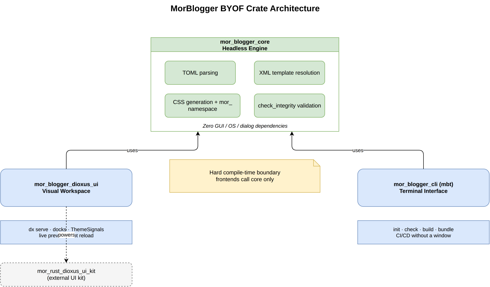
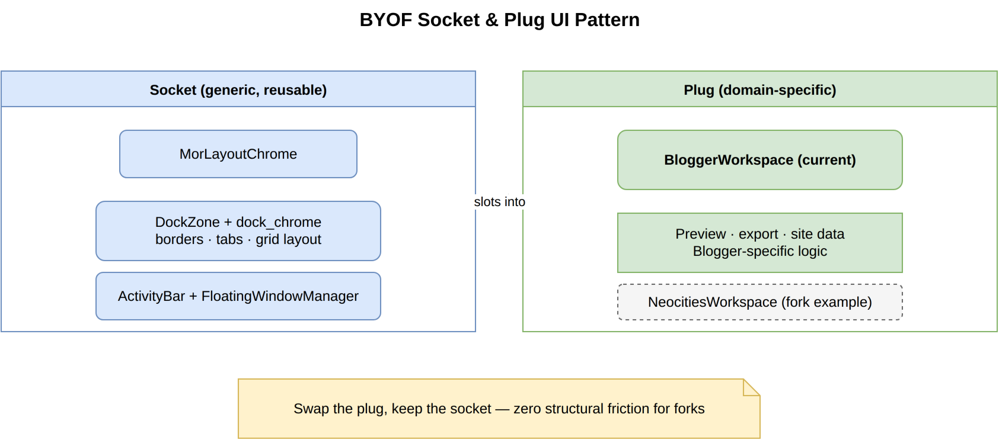
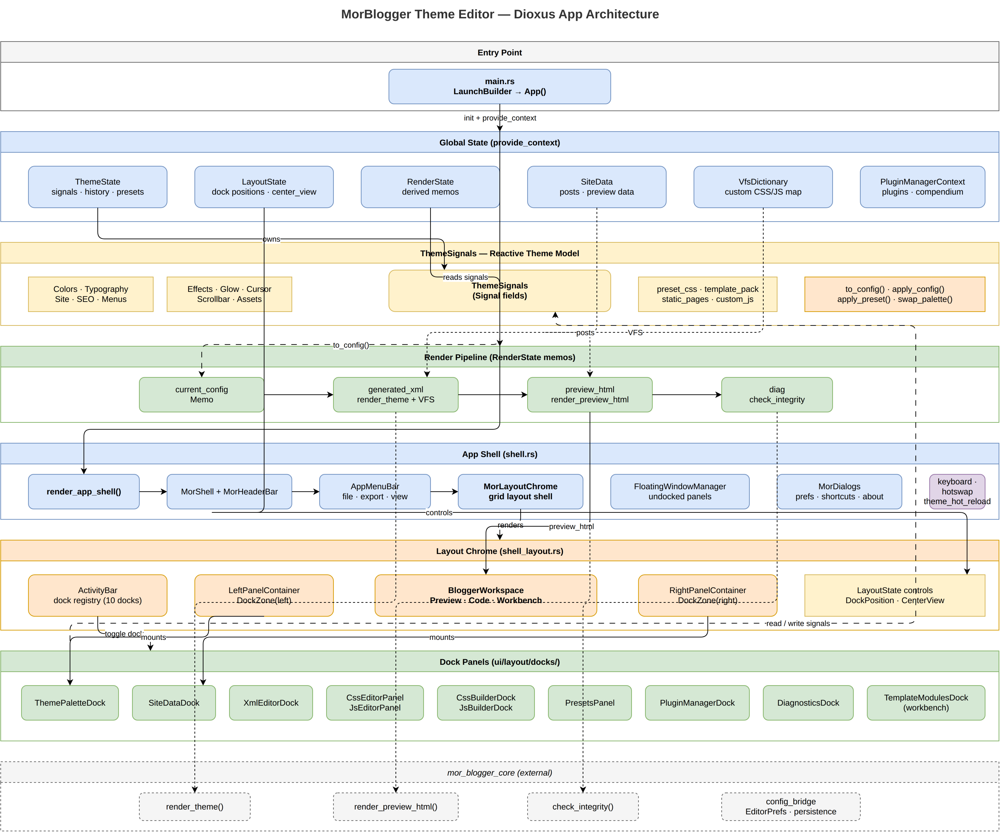
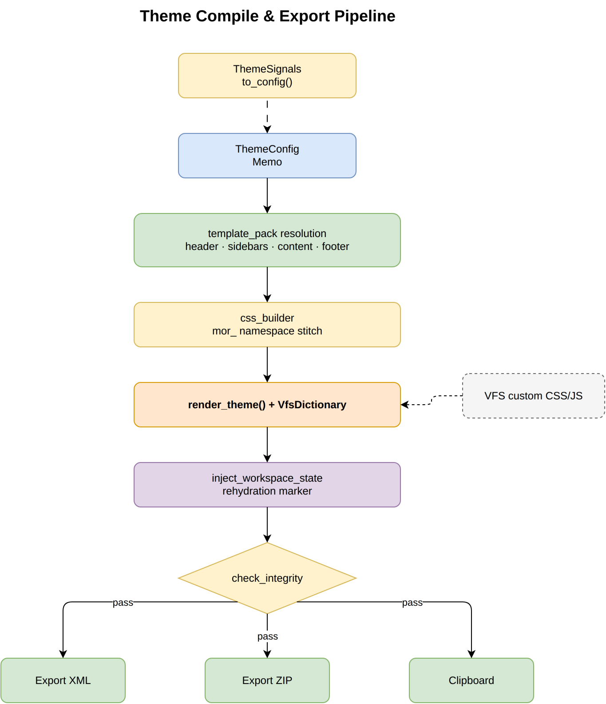
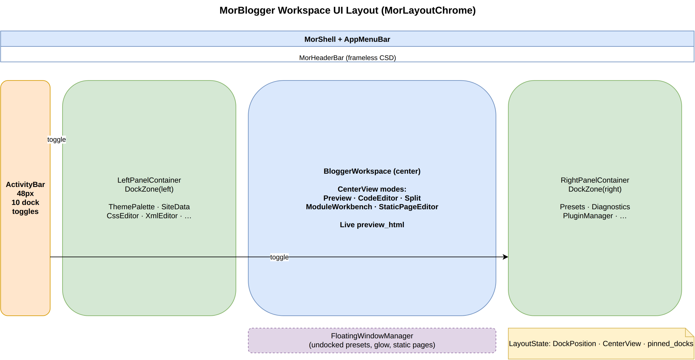
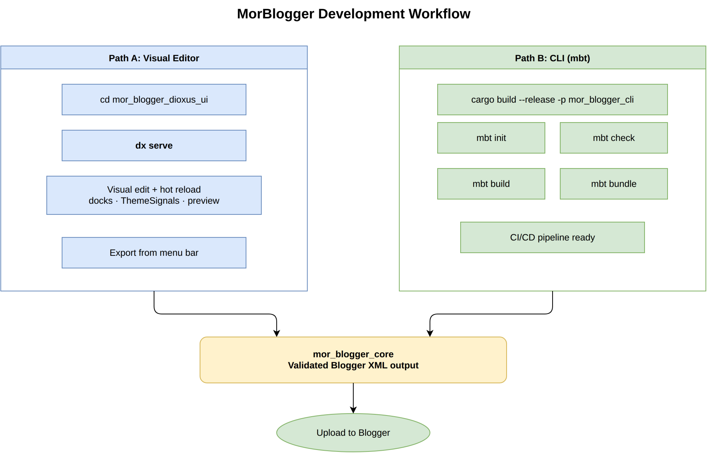

# Architecture Overview

MorBlogger separates theme compilation logic from the tools used to edit themes. The workspace is split into three crates with hard compile-time boundaries, and the Dioxus UI uses a reactive signal layer to drive rendering and export.

## BYOF Crate Boundaries

- **`mor_blogger_core`** — Headless engine: TOML parsing, XML template resolution, CSS generation, structural validation. No GUI or OS dependencies.
- **`mor_blogger_dioxus_ui`** — Visual workspace powered by Dioxus 0.7 and `mor_rust_dioxus_ui_kit`.
- **`mor_blogger_cli` (`mbt`)** — Terminal interface for init, check, render, and bundle.

Both frontends call into `mor_blogger_core` only.

## Socket & Plug UI Pattern

The Dioxus UI uses a generic **socket** (`MorLayoutChrome`, `DockZone`, dock chrome) and a domain-specific **plug** (`BloggerWorkspace`). Forking for another platform means swapping the plug, not rebuilding the shell.

## Dioxus App: State, Docks & ThemeSignals

`App()` provides global context (`ThemeState`, `LayoutState`, `RenderState`, `SiteData`, `VfsDictionary`). `ThemeSignals` is the reactive hub; dock panels read and write signals; `RenderState` derives memos that feed the preview and export pipeline.

## Theme Compile & Export Pipeline

`ThemeSignals.to_config()` produces a `ThemeConfig` memo. The core resolves template modules, stitches CSS, calls `render_theme()`, injects workspace rehydration state, runs `check_integrity()`, then exports XML, ZIP, or clipboard.

## Workspace UI Layout

`MorLayoutChrome` arranges the ActivityBar, left/right dock zones, central `BloggerWorkspace`, and floating undocked panels. `LayoutState` controls `DockPosition` and `CenterView`.

## Development Workflow

Visual editing (`dx serve`) and CLI workflows (`mbt`) converge on validated output from `mor_blogger_core`.

## Editable Sources

All diagrams are stored as `.drawio` files in [`docs/diagrams/`](diagrams/). PNG exports embed the diagram XML and can be reopened in draw.io for editing.