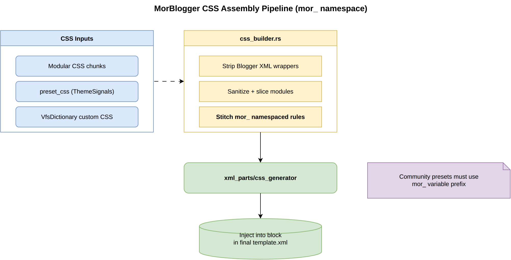

# The CSS Assembly Pipeline

MorBlogger compiles dozens of modular CSS sources into a single Blogger-compatible `<b:skin>` block. All community presets should use the `mor_` variable namespace.

## Pipeline Overview

## Inputs

| Source | Description |
|--------|-------------|
| Modular CSS chunks | Shipped template and preset stylesheets |
| `preset_css` | Active preset stylesheet bound to `ThemeSignals` |
| `VfsDictionary` | User custom CSS loaded from the workspace |

## Processing (`css_builder.rs`)

1. **Strip** — Remove accidental Blogger XML wrappers from pasted CSS.
2. **Sanitize** — Slice and validate individual modules without nesting errors.
3. **Stitch** — Merge into `mor_`-namespaced rules safe for Blogger import.

## Output

`xml_parts/css_generator` injects the compiled stylesheet into the `<b:skin>` block of the final `template.xml`.

## Related

- [Architecture Overview](ARCHITECTURE.md) — Full compile and export flow
- [Theme Creation Guide](THEME_CREATION.md) — Naming conventions for preset authors